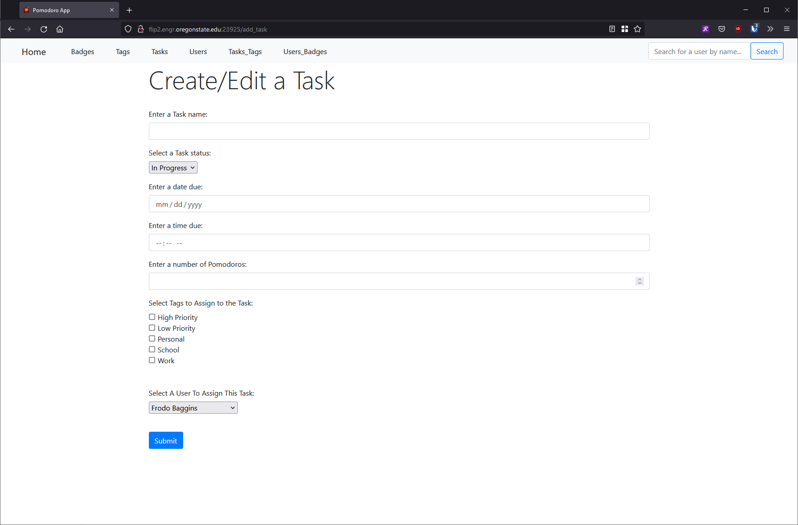
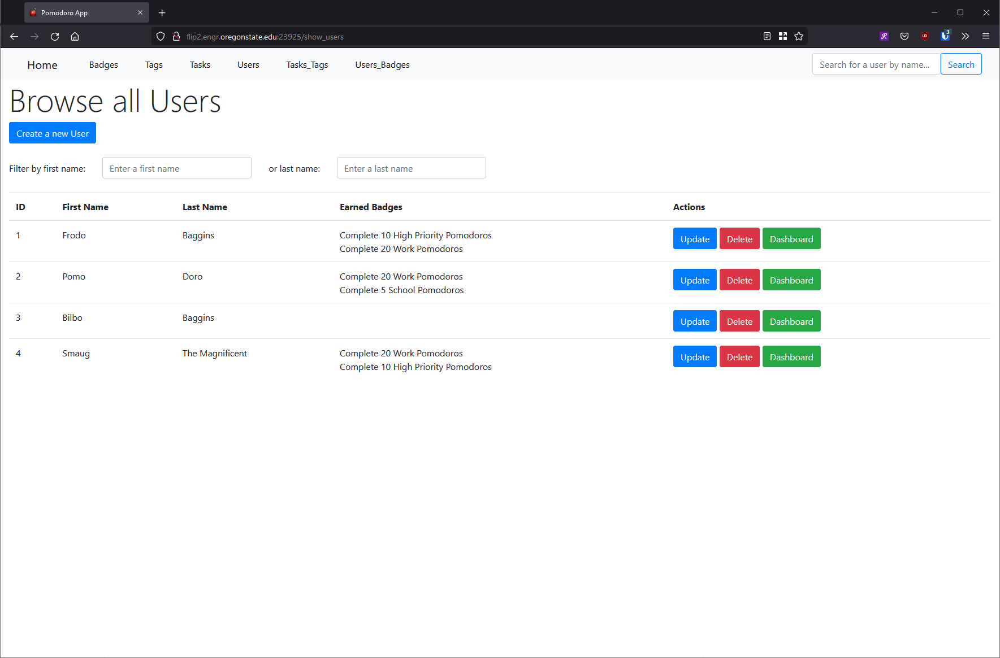
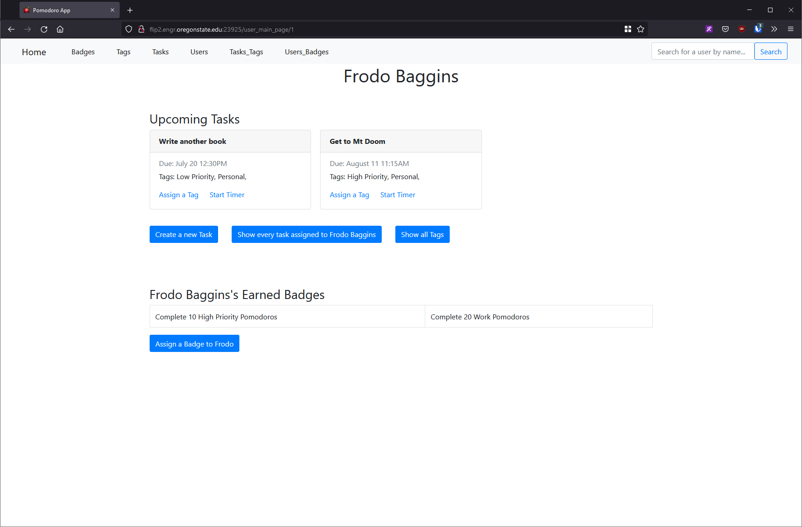

# Task Tracking SQL Database w/ Admin Web UI

Based on this project: https://github.com/paulscrugham/cs340-project in collaboration with [legendMK13](https://github.com/legendMK13)

This project is task-tracking database with an admin web interface that allows a non-technical user to create/read/update/delete any database entity and modify relationships. 

This project was completed as a part of the course CS340 - Databases at Oregon State University.

# Web Pages

The database stores four entities (Tasks, Users, Tags, and Badges) with the web application supporting CRUD operations for each entity. Here are a few examples of pages for browsing and updating entities.

## Browse Tasks

The Browse all Tasks page allows an admin to view all Tasks as well as create, update, or delete them. The "Timer" button takes the user to a Pomodoro timer page to help complete the task.

## Create Tasks

The Create/Edit a Task page allows a user to either create a new Task or update an existing one. If updating an existing Task, the forms fields are pre-populated with the Task's data.

## Browse Users

The Browse Users page allows an admin to view all Users as well as create, update, or delete them. The "Dashboard" button loads a page that shows task information specific to the selected user.

## User Dashboard

The User dashboard page shows upcoming tasks and earned badges for a specific User. 

## Steps for installing app server

1. `virtualenv venv -p $(which python3)`

2. `source ./venv/bin/activate`

3. `pip3 install --upgrade pip`
4. `pip install -r requirements.txt`

## Steps for running server
1. `python -m flask run -h 0.0.0.0 -p [port number] --reload`
